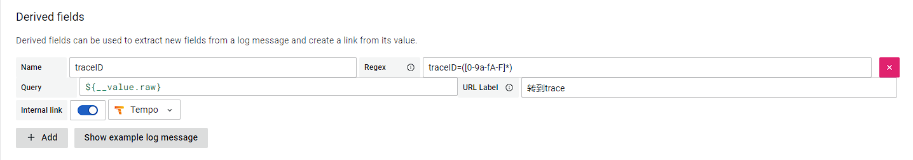

<!-- TOC -->

- [honey 是什么](#honey-是什么)
- [关键概念](#关键概念)
  - [zapp](#zapp)
  - [input](#input)
  - [output](#output)
  - [compress](#compress)
  - [serializer](#serializer)
- [结构图](#结构图)
- [架构图](#架构图)
- [如何运行](#如何运行)
  - [本地编译运行](#本地编译运行)
  - [在 docker 运行](#在-docker-运行)
  - [使用 docker-compose](#使用-docker-compose)
- [配置](#配置)
- [zapp日志收集插件](#zapp日志收集插件)
- [Grafana接入](#grafana接入)
  - [在`Loki`上配置trace跳转.](#在loki上配置trace跳转)
  - [在`Tempo`上配置log跳转.](#在tempo上配置log跳转)

<!-- /TOC -->

---

# honey 是什么

honey是一个开源的基于 [zapp](https://github.com/zly-app/zapp) 的日志收集处理工具. 目的是收集任何基于 `zapp` 开发的项目的日志并转储到任何地方.

# 关键概念

在深入了解 `honey` 之前, 最好熟悉该服务的一些关键概念, 我们再下面提供了我们定义的部分术语描述.

## zapp

`zapp` 是一个用于快速构建项目的基础库, 点 [这里](https://github.com/zly-app/zapp) 了解更多.

## input

`input` 从其它任何地方接收日志, 比如 `honey-http`, `kafka`, `pulasr` 等

## output

`output` 将日志处理并存放到用于日志分析的地方, 如 `clickhouse`, `elasticsearch`, `loki`, `Influx` 等

## compress

压缩器, 目前支持 `raw`, `gzip`, `zstd`

## serializer

序列化器, 目前支持 `json`, `msgpack`

# 结构图

待补充...

# 架构图

待补充...

# 如何运行

## 本地编译运行

```sh
git clone https://github.com/zly-app/honey.git
cd honey
go run .
```

## 在 docker 运行

```sh
docker run zlyuan/honey:latest
```

## 使用 docker-compose

```sh
wget https://github.com/zly-app/honey/blob/master/docker-compose.yml
docker-compose up -d
```

# 配置

默认配置文件路径 `./configs/default.yaml`, 默认配置文件可以不存在. 使用 `-c` 以指定配置文件启动, 此时配置文件必须存在.

详细配置文件书写参考[这里](./configs/default.yaml)

示例:

```yaml
services: # 服务配置
  honey: # honey服务
    Inputs: http # 输入设备列表, 多个输入设备用半角逗号`,`分隔, 目前支持的输入设备: http
    Outputs: std # 输出设备列表, 多个输出设备用半角逗号`,`分隔, 目前支持的输出设备: std, honey-http, loki-http

input: # honey 输入器
  http: # http 输入器
    #Bind: :8080 # 监听地址, 示例: :8080
    #PushPath: /push # 推送路径
```

# zapp日志收集插件

转到 [这里](https://github.com/zly-app/plugin/tree/master/honey)

# Grafana接入

`Grafana`本身和`honey`没有什么关系, `honey`将数据存储到`Loki`, 然后`Grafana`使用`Loki`的数据进行可视化.

首先需要在`Grafana`上配置好`Loki`和`Tempo`的数据源


## 在`Loki`上配置trace跳转.

进入`Loki`数据源配置, 在 `Derived fields` 下增加一个导出字段.

`Name` 为 `traceID`.
`Regex` 为 `traceID=([0-9a-fA-F]*)`.
`Query` 为 `${__value.raw}`
`URL Label` 为 `转到trace`
`Internal Link` 启用并设为 `Tempo`



最终日志数据会得到一个`转到trace`的按钮, 点击他会跳转到`Tempo`的当前traceID


## 在`Tempo`上配置log跳转.

进入 `Tempo`数据源配置, 在`Trace to logs`下修改配置类似下图


最终trace数据会得到一个`Logs for this span`的按钮, 点击他会跳转到`Loki`的当前traceID日志


